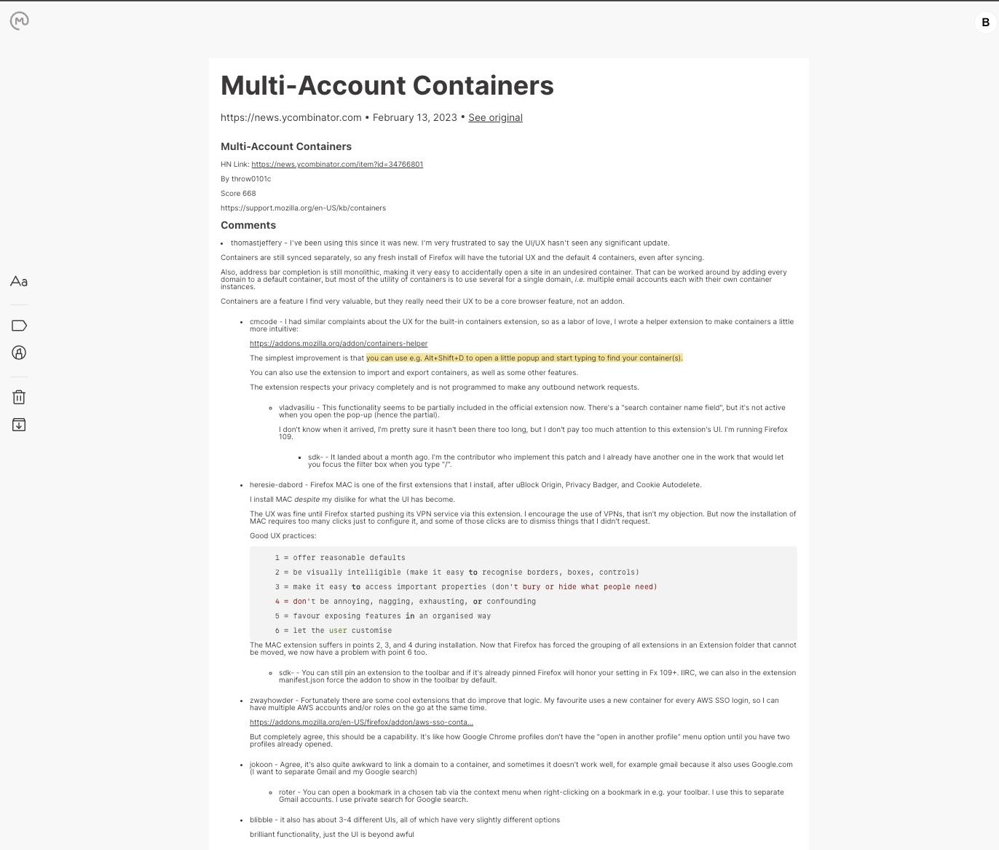

# Omnivore HN Comments

A chrome extension that adds Hacker News from a story to the [Omnivore](https://omnivore.app) read it later app.

# Demo

## Installation

1. `git clone
2. `npm install`
3. `npm run build`
4. Go to [chrome://extensions](chrome://extensions)
5. Load unpacked extension

## Usage
1. Make sure you're logged into the [Omnivore website](https://omnivore.app/login)
2. Go to [Hacker News](https://news.ycombinator.com), click on a story, then click the Omnivore HN Comments extension icon in the top right of your browser.
